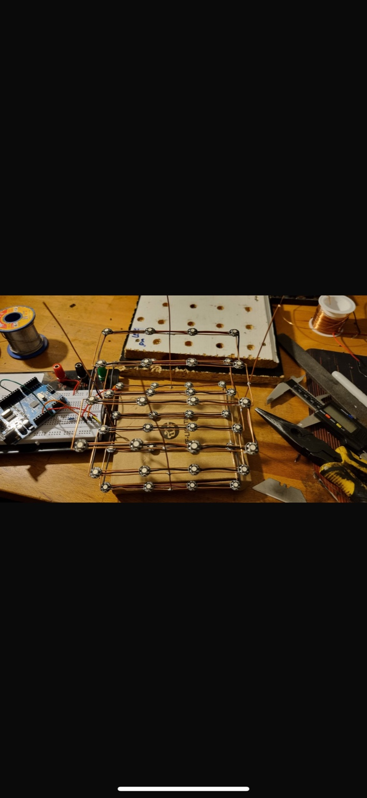
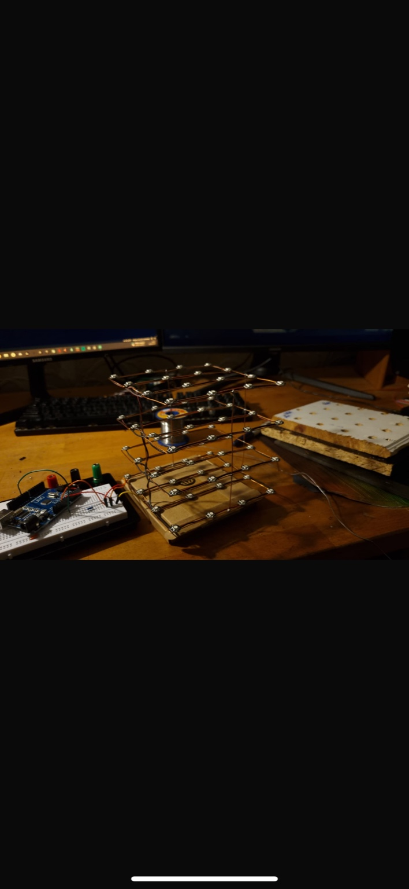
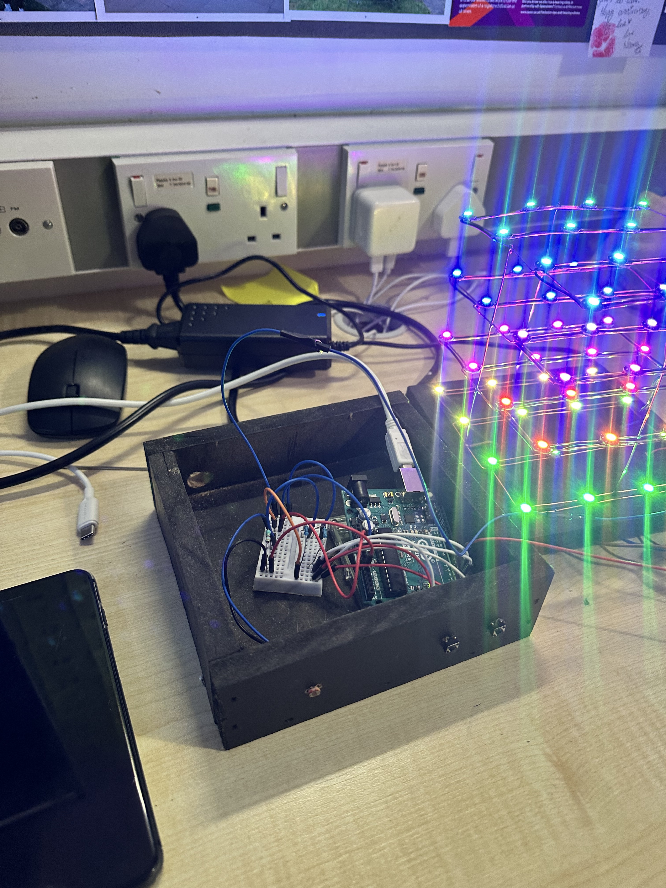
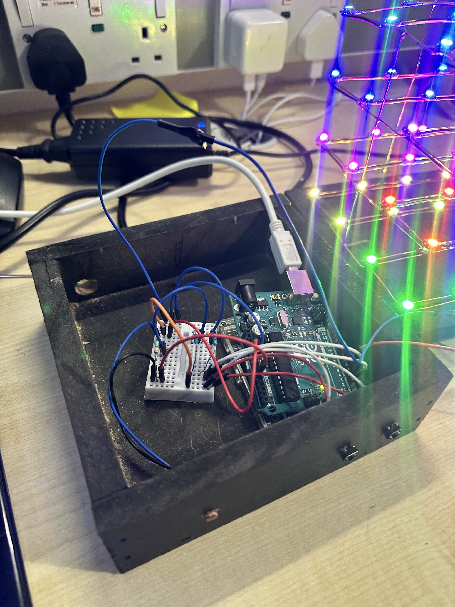
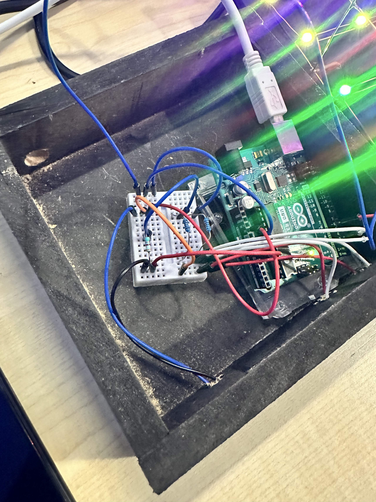
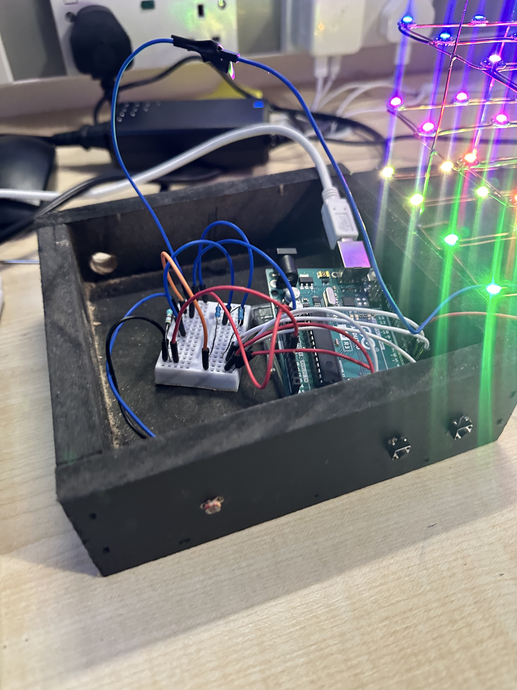
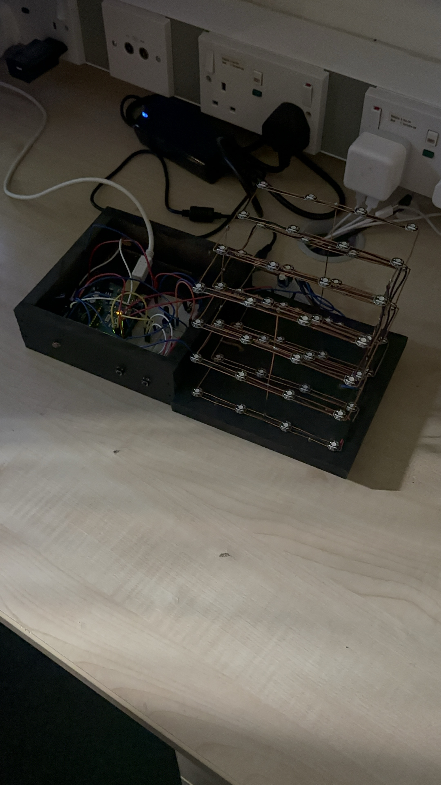
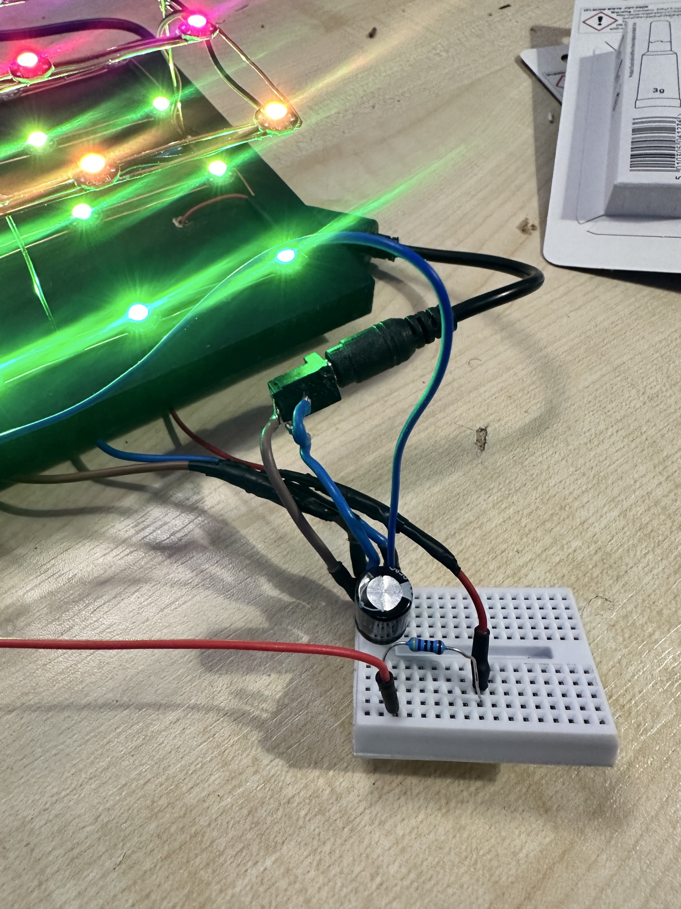
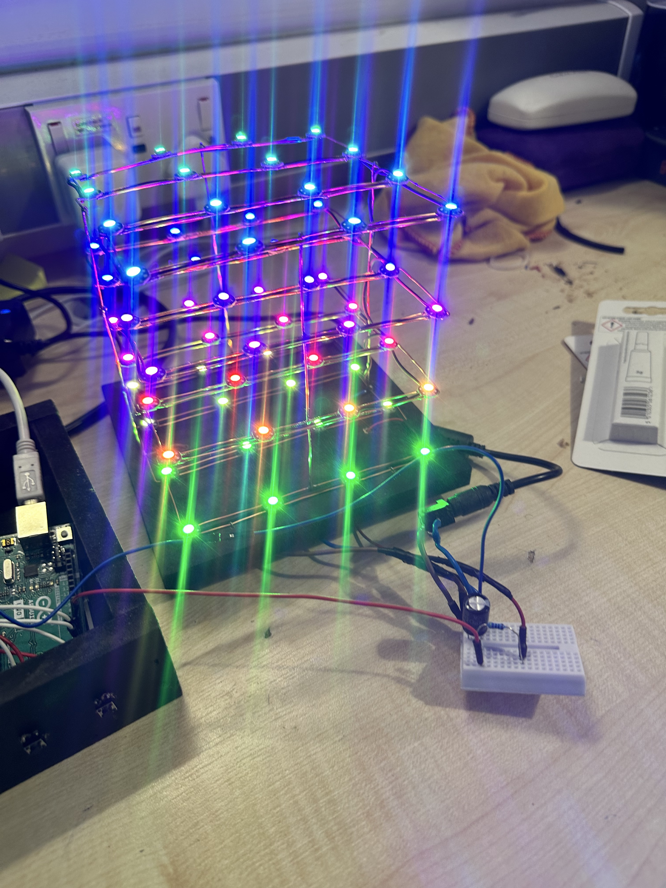

## 📸 Project Image Gallery

### 🔧 Build Process

<table>
  <tr>
    <td width="45%">
      <b>Cube Layer Assembly – Top View</b> 
      Early stage of the cube build showing precise LED spacing and alignment during layer soldering.
    </td>
    <td>
      
    </td>
  </tr>

  <tr>
    <td width="45%">
      <b>Cube Layer Assembly – Alternate View</b> 
      Additional angle demonstrating vertical alignment and wiring consistency across the 4×4 grid.
    </td>
    <td>
      
    </td>
  </tr>

  <tr>
    <td width="45%">
      <b>Top View of Completed Layer</b> 
      A completed LED layer before stacking, ensuring continuity and correct data flow direction.
    </td>
    <td>
      
    </td>
  </tr>

  <tr>
    <td width="45%">
      <b>Cube Frame – Angle View</b> 
      Shows structural integrity and layering technique before final full assembly.
    </td>
    <td>
      
    </td>
  </tr>

  <tr>
    <td width="45%">
      <b>Cube Test – Full Bright RGB Front View</b> 
      Testing all LEDs at full output to confirm solder joints, power stability and data propagation.
    </td>
    <td>
      
    </td>
  </tr>

  <tr>
    <td width="45%">
      <b>Cube Test – Alternate Front View</b> 
      Additional brightness and alignment verification from a different perspective.
    </td>
    <td>
      
    </td>
  </tr>

  <tr>
    <td width="45%">
      <b>Internal Wiring – Arduino + Breadboard</b> 
      The internal control section showing connections between Arduino, LDR, buttons and buzzer.
    </td>
    <td>
      
    </td>
  </tr>

  <tr>
    <td width="45%">
      <b>Internal Wiring – Secondary Angle</b> 
      Highlights cable routing and power distribution inside the enclosure.
    </td>
    <td>
      
    </td>
  </tr>

  <tr>
    <td width="45%">
      <b>Final Assembly – Complete Cube Setup</b> 
      The finished NeoPixel cube mounted in the enclosure ready for demonstration.
    </td>
    <td>
      
    </td>
  </tr>

  <tr>
    <td width="45%">
      <b>Power Filtering Circuit</b> 
      Close-up of the 1000µF capacitor used for stabilising the 5V rail supplying the LEDs.
    </td>
    <td>
      
    </td>
  </tr>

  <tr>
    <td width="45%">
      <b>Power Distribution Wiring Into the Cube</b> 
      Shows how clean wiring ensures stable current delivery to all LED layers.
    </td>
    <td>
      
    </td>
  </tr>

</table>
